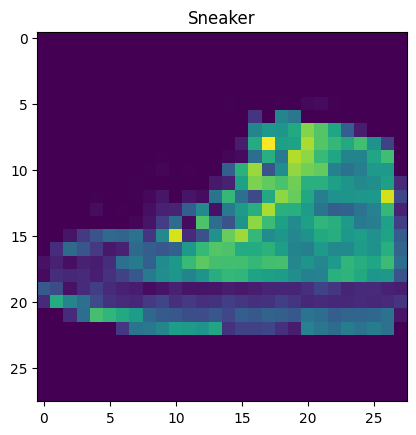
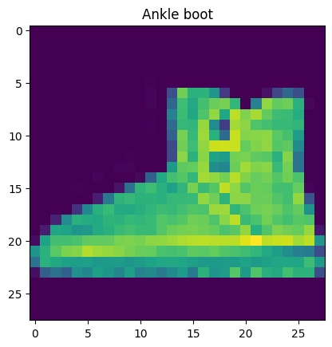

<a href="https://colab.research.google.com/github/LamineTourelab/Tutorial/blob/main/machine%20learning/tensorflow_API_tutorial.ipynb" target="_parent"></a>

# Tensorflow sequential API

A Sequential model is appropriate for a plain stack of layers where each layer has exactly one input tensor and one output tensor.

**Get an overview on keras [here](https://www.tensorflow.org/guide/keras).**


```python
import tensorflow as tf
from tensorflow import keras
import os
import pandas as pd
import numpy as np
import matplotlib.pyplot as plt
```


```python
fashion_mnist_data = keras.datasets.fashion_mnist
(all_x_train, all_y_train), (x_test, y_test) = fashion_mnist_data.load_data()

all_x_train = all_x_train.astype('float32')
x_test = x_test.astype('float32')


print(f"all_x_train.shape = {all_x_train.shape}")
print(f"all_x_train[0].shape = {all_x_train[0].shape}")
print(f"all_x_train[0].dtype = {all_x_train[0].dtype}")


x_validation, x_train = all_x_train[:5000] / 255.0, all_x_train[5000:] / 255.0
y_validation, y_train = all_y_train[:5000], all_y_train[5000:]

print(f"x_train.shape = {x_train.shape}")
print(f"x_train[0].shape = {x_train[0].shape}")
print(f"x_train[0].dtype = {x_train[0].dtype}")


fashion_mnist_class_names = ["T-shirt/top", "Trouser", "Pullover", "Dress", "Coat", "Sandal", "Shirt", "Sneaker", "Bag", "Ankle boot"]


for cls in range(10):
    print(cls, ":",fashion_mnist_class_names[y_train[cls]])


for i in range(5):
    my_img= x_train[i]
    my_img_class = y_train[i]
    my_img_class_name = fashion_mnist_class_names[my_img_class]
    plt.imshow(my_img)
    plt.title(my_img_class_name)
    plt.show()
```

    all_x_train.shape = (60000, 28, 28)
    all_x_train[0].shape = (28, 28)
    all_x_train[0].dtype = float32
    x_train.shape = (55000, 28, 28)
    x_train[0].shape = (28, 28)
    x_train[0].dtype = float32
    0 : Coat
    1 : T-shirt/top
    2 : Sneaker
    3 : Ankle boot
    4 : Ankle boot
    5 : Ankle boot
    6 : Coat
    7 : Coat
    8 : Dress
    9 : Coat


    

    


    

    


    

    


    

    


    

    


```python
model = keras.models.Sequential()
model.add(keras.layers.Flatten(input_shape=[28, 28]))
model.add(keras.layers.Dense(300, activation="relu"))
model.add(keras.layers.Dense(150, activation="relu"))
model.add(keras.layers.Dense(10, activation="softmax"))

model.summary()


print(model.layers)
print(model.layers[2].name)
```

    Model: "sequential"
    _________________________________________________________________
     Layer (type)                Output Shape              Param #   
    =================================================================
     flatten (Flatten)           (None, 784)               0         
                                                                     
     dense (Dense)               (None, 300)               235500    
                                                                     
     dense_1 (Dense)             (None, 150)               45150     
                                                                     
     dense_2 (Dense)             (None, 10)                1510      
                                                                     
    =================================================================
    Total params: 282160 (1.08 MB)
    Trainable params: 282160 (1.08 MB)
    Non-trainable params: 0 (0.00 Byte)
    _________________________________________________________________
    [<keras.src.layers.reshaping.flatten.Flatten object at 0x7a4efec1a320>, <keras.src.layers.core.dense.Dense object at 0x7a4efc795690>, <keras.src.layers.core.dense.Dense object at 0x7a4efc794220>, <keras.src.layers.core.dense.Dense object at 0x7a4efc794190>]
    dense_1


## Compilation


```python
model.compile(loss="sparse_categorical_crossentropy", optimizer="sgd", metrics=["accuracy"])
```

## Training


```python
results = model.fit(x_train, y_train, epochs=10,\
                    validation_data=(x_validation, y_validation))
```

    Epoch 1/10
    1719/1719 [==============================] - 20s 11ms/step - loss: 0.7264 - accuracy: 0.7619 - val_loss: 0.5066 - val_accuracy: 0.8276
    Epoch 2/10
    1719/1719 [==============================] - 16s 9ms/step - loss: 0.4924 - accuracy: 0.8283 - val_loss: 0.4655 - val_accuracy: 0.8408
    Epoch 3/10
    1719/1719 [==============================] - 16s 10ms/step - loss: 0.4453 - accuracy: 0.8443 - val_loss: 0.4157 - val_accuracy: 0.8594
    Epoch 4/10
    1719/1719 [==============================] - 10s 6ms/step - loss: 0.4173 - accuracy: 0.8536 - val_loss: 0.4018 - val_accuracy: 0.8642
    Epoch 5/10
    1719/1719 [==============================] - 9s 5ms/step - loss: 0.3964 - accuracy: 0.8609 - val_loss: 0.3930 - val_accuracy: 0.8650
    Epoch 6/10
    1719/1719 [==============================] - 10s 6ms/step - loss: 0.3798 - accuracy: 0.8657 - val_loss: 0.3848 - val_accuracy: 0.8658
    Epoch 7/10
    1719/1719 [==============================] - 10s 6ms/step - loss: 0.3658 - accuracy: 0.8706 - val_loss: 0.3583 - val_accuracy: 0.8784
    Epoch 8/10
    1719/1719 [==============================] - 10s 6ms/step - loss: 0.3544 - accuracy: 0.8748 - val_loss: 0.3682 - val_accuracy: 0.8728
    Epoch 9/10
    1719/1719 [==============================] - 10s 6ms/step - loss: 0.3432 - accuracy: 0.8782 - val_loss: 0.3495 - val_accuracy: 0.8772
    Epoch 10/10
    1719/1719 [==============================] - 11s 7ms/step - loss: 0.3347 - accuracy: 0.8805 - val_loss: 0.3383 - val_accuracy: 0.8824


## Results Analysis


```python
pd.DataFrame(results.history).plot(figsize=(8, 5))
plt.grid(True)
plt.gca().set_ylim(0, 1)
plt.show()
```


    

    


## Model evaluation


```python
x_test= x_test/255.0
print("Evaluation du modèle :")
model.evaluate(x_test, y_test)
```

    Evaluation du modèle :
    313/313 [==============================] - 2s 5ms/step - loss: 0.3756 - accuracy: 0.8681


    [0.3756197392940521, 0.8680999875068665]


## Model prediction


```python
x_new = x_test[11:20]
y_prob = model.predict(x_new)
print(f"y_prob = {y_prob.round(2)}")
y_prediction = model.predict(x_new)
print(f"y_prediction = {y_prediction}")


```

    1/1 [==============================] - 0s 26ms/step
    y_prob = [[0.   0.   0.   0.   0.   0.94 0.   0.03 0.   0.03]
     [0.   0.   0.   0.01 0.   0.37 0.   0.45 0.17 0.  ]
     [0.   0.01 0.   0.99 0.   0.   0.   0.   0.   0.  ]
     [0.   0.   0.2  0.   0.75 0.   0.02 0.   0.02 0.  ]
     [0.   0.99 0.   0.   0.   0.   0.   0.   0.   0.  ]
     [0.02 0.   0.96 0.   0.01 0.   0.01 0.   0.   0.  ]
     [0.   0.   0.78 0.   0.16 0.   0.06 0.   0.   0.  ]
     [0.   0.   0.   0.   0.   0.   0.   0.   1.   0.  ]
     [0.95 0.   0.   0.   0.   0.   0.05 0.   0.   0.  ]]
    1/1 [==============================] - 0s 26ms/step
    y_prediction = [[3.1884041e-04 9.0832909e-06 2.2825778e-04 7.7158285e-05 2.8249460e-05
      9.4131207e-01 4.9991539e-04 2.9197719e-02 3.3048738e-03 2.5023883e-02]
     [2.8612296e-04 2.5517552e-04 5.2534125e-04 1.1631102e-02 5.4271437e-05
      3.6781955e-01 3.3234953e-04 4.5135418e-01 1.6645952e-01 1.2823747e-03]
     [1.8247330e-04 1.0255000e-02 1.5272074e-04 9.8864001e-01 1.5142665e-04
      5.2109713e-06 5.4259861e-05 1.3752261e-05 5.3833018e-04 6.7150231e-06]
     [4.9151644e-05 6.2005820e-05 2.0411910e-01 3.4922175e-04 7.4825048e-01
      1.1576705e-09 2.2210740e-02 1.0316979e-09 2.4959395e-02 9.1224861e-10]
     [5.2958861e-04 9.9382234e-01 1.3185898e-04 4.9118144e-03 5.0863827e-04
      1.1390349e-06 6.2134888e-05 2.0139789e-06 2.8816045e-05 1.5881855e-06]
     [1.7020402e-02 1.6831007e-03 9.6144742e-01 9.4521814e-04 5.4272199e-03
      4.9377145e-06 1.3044720e-02 1.3532654e-06 4.2115254e-04 4.3969744e-06]
     [1.0709631e-03 5.9443355e-05 7.8045821e-01 2.2999026e-04 1.5594642e-01
      9.6357153e-09 6.1186492e-02 3.0131968e-08 1.0483154e-03 8.8528068e-08]
     [9.1176917e-05 1.4379219e-06 1.7904839e-04 2.8298934e-06 5.8932448e-05
      9.7865406e-05 1.8255299e-04 1.4076787e-05 9.9936873e-01 3.3107310e-06]
     [9.4995093e-01 1.5609858e-05 3.6273990e-04 7.0983241e-04 1.8508168e-06
      1.7300086e-09 4.8956469e-02 1.3470089e-08 2.5965862e-06 3.4715937e-09]]


A Sequential model is not **appropriate** when:

+ Your model has multiple inputs or multiple outputs
+ Any of your layers has multiple inputs or multiple outputs
+ You need to do layer sharing
+ You want non-linear topology (e.g. a residual connection, a multi-branch model)

# Tensorflow functional API

The Keras functional API is a way to create models that are more flexible than the `keras.Sequential API`. The functional API can handle models with non-linear topology, shared layers, and even multiple inputs or outputs.


```python

from sklearn.datasets import fetch_california_housing
from sklearn.model_selection import train_test_split
from sklearn.preprocessing import StandardScaler
```


```python
housing = fetch_california_housing()
all_x_train, x_test, all_y_train, y_test = train_test_split(housing.data, housing.target)


x_train, x_validation, y_train, y_validation = train_test_split(all_x_train, all_y_train)
scaler = StandardScaler()
x_train_scaled = scaler.fit_transform(x_train)
x_validation_scaled = scaler.transform(x_validation)
x_test_scaled = scaler.transform(x_test)
```


```python
input = keras.layers.Input(shape=x_train_scaled.shape[1:])
hidden1 = keras.layers.Dense(30, activation="relu")(input)
hidden2 = keras.layers.Dense(30, activation="relu")(hidden1)
hidden3 = keras.layers.Dense(30, activation="relu")(hidden2)
output = keras.layers.Dense(1)(hidden3)

model = keras.models.Model(inputs=[input], outputs=[output])

```


```python
model.compile(loss="mse", optimizer="rmsprop", metrics=["mae"])
ressults = model.fit(x_train_scaled, y_train, epochs=40, validation_data=(x_validation_scaled, y_validation))

res_eval = model.evaluate(x_test_scaled, y_test)
```

    Epoch 1/40
    363/363 [==============================] - 2s 3ms/step - loss: 1.3137 - mae: 0.7744 - val_loss: 0.4826 - val_mae: 0.5053
    Epoch 2/40
    363/363 [==============================] - 1s 4ms/step - loss: 0.4395 - mae: 0.4717 - val_loss: 0.3986 - val_mae: 0.4432
    Epoch 3/40
    363/363 [==============================] - 1s 3ms/step - loss: 0.3878 - mae: 0.4435 - val_loss: 0.3695 - val_mae: 0.4184
    Epoch 4/40
    363/363 [==============================] - 2s 6ms/step - loss: 0.3679 - mae: 0.4315 - val_loss: 0.3603 - val_mae: 0.4186
    Epoch 5/40
    363/363 [==============================] - 2s 4ms/step - loss: 0.3657 - mae: 0.4233 - val_loss: 0.3431 - val_mae: 0.4132
    Epoch 6/40
    363/363 [==============================] - 1s 3ms/step - loss: 0.3511 - mae: 0.4183 - val_loss: 0.3349 - val_mae: 0.4039
    Epoch 7/40
    363/363 [==============================] - 1s 3ms/step - loss: 0.3474 - mae: 0.4127 - val_loss: 0.3276 - val_mae: 0.4054
    Epoch 8/40
    363/363 [==============================] - 1s 3ms/step - loss: 0.3348 - mae: 0.4080 - val_loss: 0.3299 - val_mae: 0.3922
    Epoch 9/40
    363/363 [==============================] - 1s 3ms/step - loss: 0.3313 - mae: 0.4019 - val_loss: 0.3175 - val_mae: 0.3899
    Epoch 10/40
    363/363 [==============================] - 1s 3ms/step - loss: 0.3208 - mae: 0.3983 - val_loss: 0.3185 - val_mae: 0.3891
    Epoch 11/40
    363/363 [==============================] - 1s 3ms/step - loss: 0.3256 - mae: 0.3943 - val_loss: 0.3218 - val_mae: 0.4053
    Epoch 12/40
    363/363 [==============================] - 1s 3ms/step - loss: 0.3161 - mae: 0.3885 - val_loss: 0.3141 - val_mae: 0.3909
    Epoch 13/40
    363/363 [==============================] - 1s 3ms/step - loss: 0.3054 - mae: 0.3863 - val_loss: 0.3059 - val_mae: 0.3810
    Epoch 14/40
    363/363 [==============================] - 1s 3ms/step - loss: 0.3020 - mae: 0.3830 - val_loss: 0.3081 - val_mae: 0.3870
    Epoch 15/40
    363/363 [==============================] - 1s 3ms/step - loss: 0.2982 - mae: 0.3805 - val_loss: 0.2988 - val_mae: 0.3683
    Epoch 16/40
    363/363 [==============================] - 1s 4ms/step - loss: 0.3020 - mae: 0.3787 - val_loss: 0.3170 - val_mae: 0.3918
    Epoch 17/40
    363/363 [==============================] - 2s 4ms/step - loss: 0.2956 - mae: 0.3756 - val_loss: 0.3040 - val_mae: 0.3735
    Epoch 18/40
    363/363 [==============================] - 1s 4ms/step - loss: 0.2984 - mae: 0.3753 - val_loss: 0.3033 - val_mae: 0.3791
    Epoch 19/40
    363/363 [==============================] - 1s 3ms/step - loss: 0.2913 - mae: 0.3721 - val_loss: 0.3025 - val_mae: 0.3765
    Epoch 20/40
    363/363 [==============================] - 1s 3ms/step - loss: 0.2875 - mae: 0.3716 - val_loss: 0.3015 - val_mae: 0.3717
    Epoch 21/40
    363/363 [==============================] - 1s 3ms/step - loss: 0.2911 - mae: 0.3690 - val_loss: 0.3252 - val_mae: 0.4026
    Epoch 22/40
    363/363 [==============================] - 1s 3ms/step - loss: 0.3021 - mae: 0.3701 - val_loss: 0.3102 - val_mae: 0.3670
    Epoch 23/40
    363/363 [==============================] - 1s 3ms/step - loss: 0.2868 - mae: 0.3675 - val_loss: 0.2921 - val_mae: 0.3669
    Epoch 24/40
    363/363 [==============================] - 1s 3ms/step - loss: 0.2871 - mae: 0.3663 - val_loss: 0.2926 - val_mae: 0.3615
    Epoch 25/40
    363/363 [==============================] - 1s 3ms/step - loss: 0.2849 - mae: 0.3647 - val_loss: 0.2992 - val_mae: 0.3779
    Epoch 26/40
    363/363 [==============================] - 1s 3ms/step - loss: 0.2785 - mae: 0.3638 - val_loss: 0.2973 - val_mae: 0.3587
    Epoch 27/40
    363/363 [==============================] - 1s 3ms/step - loss: 0.2770 - mae: 0.3627 - val_loss: 0.2911 - val_mae: 0.3624
    Epoch 28/40
    363/363 [==============================] - 1s 3ms/step - loss: 0.2839 - mae: 0.3622 - val_loss: 0.2907 - val_mae: 0.3567
    Epoch 29/40
    363/363 [==============================] - 1s 4ms/step - loss: 0.2766 - mae: 0.3621 - val_loss: 0.2958 - val_mae: 0.3631
    Epoch 30/40
    363/363 [==============================] - 2s 4ms/step - loss: 0.2765 - mae: 0.3597 - val_loss: 0.2879 - val_mae: 0.3657
    Epoch 31/40
    363/363 [==============================] - 1s 4ms/step - loss: 0.2758 - mae: 0.3598 - val_loss: 0.2945 - val_mae: 0.3584
    Epoch 32/40
    363/363 [==============================] - 1s 3ms/step - loss: 0.2722 - mae: 0.3580 - val_loss: 0.2875 - val_mae: 0.3611
    Epoch 33/40
    363/363 [==============================] - 1s 3ms/step - loss: 0.2824 - mae: 0.3592 - val_loss: 0.2927 - val_mae: 0.3670
    Epoch 34/40
    363/363 [==============================] - 1s 3ms/step - loss: 0.2741 - mae: 0.3578 - val_loss: 0.2839 - val_mae: 0.3552
    Epoch 35/40
    363/363 [==============================] - 1s 3ms/step - loss: 0.2707 - mae: 0.3559 - val_loss: 0.2866 - val_mae: 0.3581
    Epoch 36/40
    363/363 [==============================] - 1s 3ms/step - loss: 0.2732 - mae: 0.3556 - val_loss: 0.2865 - val_mae: 0.3572
    Epoch 37/40
    363/363 [==============================] - 1s 2ms/step - loss: 0.2692 - mae: 0.3545 - val_loss: 0.3431 - val_mae: 0.4224
    Epoch 38/40
    363/363 [==============================] - 1s 3ms/step - loss: 0.2700 - mae: 0.3545 - val_loss: 0.2892 - val_mae: 0.3603
    Epoch 39/40
    363/363 [==============================] - 1s 3ms/step - loss: 0.2682 - mae: 0.3532 - val_loss: 0.3023 - val_mae: 0.3820
    Epoch 40/40
    363/363 [==============================] - 1s 3ms/step - loss: 0.2665 - mae: 0.3527 - val_loss: 0.2859 - val_mae: 0.3591
    162/162 [==============================] - 0s 3ms/step - loss: 0.2842 - mae: 0.3563


```python
pd.DataFrame(ressults.history).plot(figsize=(8, 5))
plt.grid(True)
plt.gca().set_ylim(0, 1)
plt.show()
```


    

    


# Tensorflow subclassing API


```python
housing = fetch_california_housing()
all_x_train, x_test, all_y_train, y_test = train_test_split(housing.data, housing.target)


x_train, x_validation, y_train, y_validation = train_test_split(all_x_train, all_y_train)
scaler = StandardScaler()
x_train_scaled = scaler.fit_transform(x_train)
x_validation_scaled = scaler.transform(x_validation)
x_test_scaled = scaler.transform(x_test)
```


```python

class Exemple_SubclassingAPI(keras.models.Model):

    def __init__(self, nb_unit_1, nb_unit_2, activation="relu", **kwargs):
        super().__init__(**kwargs)
        self.hidden1 = keras.layers.Dense(nb_unit_1, activation=activation)
        self.hidden2 = keras.layers.Dense(nb_unit_2, activation=activation)
        self.res = keras.layers.Dense(1)


    def call(self, inputs):
        input = inputs
        hidden1 = self.hidden1(input)
        hidden2 = self.hidden2(hidden1)
        res = self.res(hidden2)
        return res

model = Exemple_SubclassingAPI(30,15)
```


```python
model.compile(loss="mse", optimizer="rmsprop", metrics=["mae"])

resssults = model.fit(x_train_scaled, y_train, epochs=40, validation_data=(x_validation_scaled, y_validation))

mse_test = model.evaluate(x_test_scaled, y_test)
```

    Epoch 1/40
    363/363 [==============================] - 2s 3ms/step - loss: 0.2794 - mae: 0.3631 - val_loss: 0.2949 - val_mae: 0.3804
    Epoch 2/40
    363/363 [==============================] - 1s 4ms/step - loss: 0.2802 - mae: 0.3619 - val_loss: 0.2879 - val_mae: 0.3621
    Epoch 3/40
    363/363 [==============================] - 1s 4ms/step - loss: 0.2789 - mae: 0.3617 - val_loss: 0.2895 - val_mae: 0.3716
    Epoch 4/40
    363/363 [==============================] - 1s 4ms/step - loss: 0.2767 - mae: 0.3618 - val_loss: 0.2884 - val_mae: 0.3704
    Epoch 5/40
    363/363 [==============================] - 1s 3ms/step - loss: 0.2750 - mae: 0.3608 - val_loss: 0.2977 - val_mae: 0.3773
    Epoch 6/40
    363/363 [==============================] - 1s 3ms/step - loss: 0.2747 - mae: 0.3606 - val_loss: 0.2963 - val_mae: 0.3789
    Epoch 7/40
    363/363 [==============================] - 1s 3ms/step - loss: 0.2793 - mae: 0.3604 - val_loss: 0.2837 - val_mae: 0.3598
    Epoch 8/40
    363/363 [==============================] - 1s 3ms/step - loss: 0.2794 - mae: 0.3597 - val_loss: 0.2897 - val_mae: 0.3691
    Epoch 9/40
    363/363 [==============================] - 1s 2ms/step - loss: 0.2744 - mae: 0.3583 - val_loss: 0.2899 - val_mae: 0.3746
    Epoch 10/40
    363/363 [==============================] - 1s 3ms/step - loss: 0.2739 - mae: 0.3586 - val_loss: 0.2890 - val_mae: 0.3580
    Epoch 11/40
    363/363 [==============================] - 1s 3ms/step - loss: 0.2716 - mae: 0.3579 - val_loss: 0.2855 - val_mae: 0.3627
    Epoch 12/40
    363/363 [==============================] - 1s 3ms/step - loss: 0.2717 - mae: 0.3586 - val_loss: 0.2929 - val_mae: 0.3627
    Epoch 13/40
    363/363 [==============================] - 1s 3ms/step - loss: 0.2762 - mae: 0.3579 - val_loss: 0.2827 - val_mae: 0.3598
    Epoch 14/40
    363/363 [==============================] - 1s 2ms/step - loss: 0.2740 - mae: 0.3569 - val_loss: 0.2930 - val_mae: 0.3733
    Epoch 15/40
    363/363 [==============================] - 1s 4ms/step - loss: 0.2799 - mae: 0.3571 - val_loss: 0.2817 - val_mae: 0.3625
    Epoch 16/40
    363/363 [==============================] - 1s 4ms/step - loss: 0.2736 - mae: 0.3558 - val_loss: 0.2816 - val_mae: 0.3646
    Epoch 17/40
    363/363 [==============================] - 1s 4ms/step - loss: 0.2716 - mae: 0.3557 - val_loss: 0.2841 - val_mae: 0.3579
    Epoch 18/40
    363/363 [==============================] - 1s 3ms/step - loss: 0.2678 - mae: 0.3556 - val_loss: 0.2857 - val_mae: 0.3669
    Epoch 19/40
    363/363 [==============================] - 1s 3ms/step - loss: 0.2746 - mae: 0.3558 - val_loss: 0.2868 - val_mae: 0.3591
    Epoch 20/40
    363/363 [==============================] - 1s 3ms/step - loss: 0.2701 - mae: 0.3551 - val_loss: 0.2845 - val_mae: 0.3663
    Epoch 21/40
    363/363 [==============================] - 1s 3ms/step - loss: 0.2674 - mae: 0.3540 - val_loss: 0.2860 - val_mae: 0.3556
    Epoch 22/40
    363/363 [==============================] - 1s 3ms/step - loss: 0.2682 - mae: 0.3540 - val_loss: 0.2826 - val_mae: 0.3598
    Epoch 23/40
    363/363 [==============================] - 1s 2ms/step - loss: 0.2743 - mae: 0.3547 - val_loss: 0.2880 - val_mae: 0.3585
    Epoch 24/40
    363/363 [==============================] - 1s 2ms/step - loss: 0.2682 - mae: 0.3544 - val_loss: 0.2838 - val_mae: 0.3671
    Epoch 25/40
    363/363 [==============================] - 1s 3ms/step - loss: 0.2713 - mae: 0.3551 - val_loss: 0.2789 - val_mae: 0.3591
    Epoch 26/40
    363/363 [==============================] - 1s 2ms/step - loss: 0.2659 - mae: 0.3532 - val_loss: 0.2781 - val_mae: 0.3566
    Epoch 27/40
    363/363 [==============================] - 1s 3ms/step - loss: 0.2654 - mae: 0.3531 - val_loss: 0.2812 - val_mae: 0.3605
    Epoch 28/40
    363/363 [==============================] - 1s 4ms/step - loss: 0.2679 - mae: 0.3519 - val_loss: 0.2786 - val_mae: 0.3603
    Epoch 29/40
    363/363 [==============================] - 2s 5ms/step - loss: 0.2653 - mae: 0.3529 - val_loss: 0.2821 - val_mae: 0.3586
    Epoch 30/40
    363/363 [==============================] - 1s 4ms/step - loss: 0.2672 - mae: 0.3528 - val_loss: 0.2844 - val_mae: 0.3587
    Epoch 31/40
    363/363 [==============================] - 1s 3ms/step - loss: 0.2652 - mae: 0.3521 - val_loss: 0.2798 - val_mae: 0.3528
    Epoch 32/40
    363/363 [==============================] - 1s 3ms/step - loss: 0.2643 - mae: 0.3513 - val_loss: 0.2789 - val_mae: 0.3564
    Epoch 33/40
    363/363 [==============================] - 1s 3ms/step - loss: 0.2629 - mae: 0.3501 - val_loss: 0.2818 - val_mae: 0.3669
    Epoch 34/40
    363/363 [==============================] - 1s 3ms/step - loss: 0.2630 - mae: 0.3504 - val_loss: 0.2914 - val_mae: 0.3762
    Epoch 35/40
    363/363 [==============================] - 1s 3ms/step - loss: 0.2614 - mae: 0.3499 - val_loss: 0.2879 - val_mae: 0.3545
    Epoch 36/40
    363/363 [==============================] - 1s 3ms/step - loss: 0.2653 - mae: 0.3500 - val_loss: 0.2787 - val_mae: 0.3591
    Epoch 37/40
    363/363 [==============================] - 1s 3ms/step - loss: 0.2625 - mae: 0.3501 - val_loss: 0.2844 - val_mae: 0.3694
    Epoch 38/40
    363/363 [==============================] - 1s 3ms/step - loss: 0.2625 - mae: 0.3504 - val_loss: 0.2844 - val_mae: 0.3620
    Epoch 39/40
    363/363 [==============================] - 1s 3ms/step - loss: 0.2618 - mae: 0.3510 - val_loss: 0.2775 - val_mae: 0.3585
    Epoch 40/40
    363/363 [==============================] - 1s 4ms/step - loss: 0.2614 - mae: 0.3505 - val_loss: 0.2790 - val_mae: 0.3635
    162/162 [==============================] - 0s 2ms/step - loss: 0.2890 - mae: 0.3684


```python
pd.DataFrame(resssults.history).plot(figsize=(8, 5))
plt.grid(True)
plt.gca().set_ylim(0, 1)
plt.show()
```


    

    


# Let's use the sequential API for regression


```python
model = keras.models.Sequential()
model.add(keras.layers.Dense(30, activation="relu", input_shape=x_train_scaled.shape[1:]))
model.add(keras.layers.Dense(15, activation="relu"))
model.add(keras.layers.Dense(8, activation="relu"))
model.add(keras.layers.Dense(1))


model.summary()
```

    Model: "sequential_1"
    _________________________________________________________________
     Layer (type)                Output Shape              Param #   
    =================================================================
     dense_10 (Dense)            (None, 30)                270       
                                                                     
     dense_11 (Dense)            (None, 15)                465       
                                                                     
     dense_12 (Dense)            (None, 8)                 128       
                                                                     
     dense_13 (Dense)            (None, 1)                 9         
                                                                     
    =================================================================
    Total params: 872 (3.41 KB)
    Trainable params: 872 (3.41 KB)
    Non-trainable params: 0 (0.00 Byte)
    _________________________________________________________________


```python
model.compile(loss="mse", optimizer="rmsprop", metrics=["mae"])
ressults = model.fit(x_train_scaled, y_train, epochs=100, \
                     validation_data=(x_validation_scaled, y_validation))

mae_test = model.evaluate(x_test_scaled, y_test)
```

    Epoch 1/100
    363/363 [==============================] - 4s 8ms/step - loss: 1.4869 - mae: 0.7407 - val_loss: 0.4752 - val_mae: 0.5042
    Epoch 2/100
    363/363 [==============================] - 2s 5ms/step - loss: 0.4607 - mae: 0.4825 - val_loss: 0.4075 - val_mae: 0.4410
    Epoch 3/100
    363/363 [==============================] - 2s 4ms/step - loss: 0.4037 - mae: 0.4547 - val_loss: 0.3763 - val_mae: 0.4241
    Epoch 4/100
    363/363 [==============================] - 1s 3ms/step - loss: 0.3820 - mae: 0.4393 - val_loss: 0.3562 - val_mae: 0.4234
    Epoch 5/100
    363/363 [==============================] - 1s 3ms/step - loss: 0.3829 - mae: 0.4293 - val_loss: 0.3478 - val_mae: 0.4255
    Epoch 6/100
    363/363 [==============================] - 2s 4ms/step - loss: 0.3530 - mae: 0.4213 - val_loss: 0.3571 - val_mae: 0.4422
    Epoch 7/100
    363/363 [==============================] - 2s 4ms/step - loss: 0.3416 - mae: 0.4163 - val_loss: 0.3383 - val_mae: 0.4139
    Epoch 8/100
    363/363 [==============================] - 2s 4ms/step - loss: 0.3454 - mae: 0.4132 - val_loss: 0.3222 - val_mae: 0.3967
    Epoch 9/100
    363/363 [==============================] - 1s 3ms/step - loss: 0.3344 - mae: 0.4061 - val_loss: 0.3199 - val_mae: 0.3984
    Epoch 10/100
    363/363 [==============================] - 1s 4ms/step - loss: 0.3286 - mae: 0.4024 - val_loss: 0.3219 - val_mae: 0.3981
    Epoch 11/100
    363/363 [==============================] - 2s 6ms/step - loss: 0.3222 - mae: 0.3995 - val_loss: 0.3233 - val_mae: 0.3966
    Epoch 12/100
    363/363 [==============================] - 2s 4ms/step - loss: 0.3138 - mae: 0.3962 - val_loss: 0.3120 - val_mae: 0.3947
    Epoch 13/100
    363/363 [==============================] - 1s 3ms/step - loss: 0.3181 - mae: 0.3943 - val_loss: 0.3181 - val_mae: 0.3995
    Epoch 14/100
    363/363 [==============================] - 1s 3ms/step - loss: 0.3221 - mae: 0.3921 - val_loss: 0.3130 - val_mae: 0.3941
    Epoch 15/100
    363/363 [==============================] - 1s 4ms/step - loss: 0.3204 - mae: 0.3887 - val_loss: 0.3254 - val_mae: 0.4120
    Epoch 16/100
    363/363 [==============================] - 1s 3ms/step - loss: 0.3186 - mae: 0.3879 - val_loss: 0.3186 - val_mae: 0.3990
    Epoch 17/100
    363/363 [==============================] - 1s 3ms/step - loss: 0.3158 - mae: 0.3866 - val_loss: 0.3057 - val_mae: 0.3842
    Epoch 18/100
    363/363 [==============================] - 1s 3ms/step - loss: 0.3244 - mae: 0.3845 - val_loss: 0.3099 - val_mae: 0.3735
    Epoch 19/100
    363/363 [==============================] - 1s 3ms/step - loss: 0.2990 - mae: 0.3817 - val_loss: 0.3139 - val_mae: 0.3884
    Epoch 20/100
    363/363 [==============================] - 1s 3ms/step - loss: 0.3195 - mae: 0.3822 - val_loss: 0.3035 - val_mae: 0.3810
    Epoch 21/100
    363/363 [==============================] - 1s 3ms/step - loss: 0.3014 - mae: 0.3815 - val_loss: 0.3034 - val_mae: 0.3782
    Epoch 22/100
    363/363 [==============================] - 1s 4ms/step - loss: 0.3015 - mae: 0.3795 - val_loss: 0.3002 - val_mae: 0.3767
    Epoch 23/100
    363/363 [==============================] - 2s 4ms/step - loss: 0.2970 - mae: 0.3775 - val_loss: 0.3005 - val_mae: 0.3860
    Epoch 24/100
    363/363 [==============================] - 2s 4ms/step - loss: 0.3021 - mae: 0.3780 - val_loss: 0.3064 - val_mae: 0.3802
    Epoch 25/100
    363/363 [==============================] - 1s 4ms/step - loss: 0.2982 - mae: 0.3767 - val_loss: 0.3019 - val_mae: 0.3757
    Epoch 26/100
    363/363 [==============================] - 1s 3ms/step - loss: 0.3018 - mae: 0.3764 - val_loss: 0.3202 - val_mae: 0.4158
    Epoch 27/100
    363/363 [==============================] - 1s 3ms/step - loss: 0.3032 - mae: 0.3767 - val_loss: 0.3064 - val_mae: 0.3766
    Epoch 28/100
    363/363 [==============================] - 1s 4ms/step - loss: 0.2974 - mae: 0.3736 - val_loss: 0.3231 - val_mae: 0.3856
    Epoch 29/100
    363/363 [==============================] - 2s 5ms/step - loss: 0.2889 - mae: 0.3739 - val_loss: 0.3226 - val_mae: 0.4116
    Epoch 30/100
    363/363 [==============================] - 1s 4ms/step - loss: 0.2949 - mae: 0.3728 - val_loss: 0.2985 - val_mae: 0.3756
    Epoch 31/100
    363/363 [==============================] - 1s 4ms/step - loss: 0.3200 - mae: 0.3735 - val_loss: 0.3073 - val_mae: 0.3723
    Epoch 32/100
    363/363 [==============================] - 1s 4ms/step - loss: 0.3222 - mae: 0.3738 - val_loss: 0.3109 - val_mae: 0.3798
    Epoch 33/100
    363/363 [==============================] - 2s 5ms/step - loss: 0.3014 - mae: 0.3716 - val_loss: 0.3142 - val_mae: 0.4042
    Epoch 34/100
    363/363 [==============================] - 2s 6ms/step - loss: 0.2876 - mae: 0.3695 - val_loss: 0.3123 - val_mae: 0.3877
    Epoch 35/100
    363/363 [==============================] - 1s 3ms/step - loss: 0.3072 - mae: 0.3703 - val_loss: 0.3008 - val_mae: 0.3816
    Epoch 36/100
    363/363 [==============================] - 1s 3ms/step - loss: 0.2996 - mae: 0.3690 - val_loss: 0.2944 - val_mae: 0.3756
    Epoch 37/100
    363/363 [==============================] - 1s 4ms/step - loss: 0.2945 - mae: 0.3690 - val_loss: 0.2946 - val_mae: 0.3755
    Epoch 38/100
    363/363 [==============================] - 1s 3ms/step - loss: 0.3074 - mae: 0.3690 - val_loss: 0.3004 - val_mae: 0.3707
    Epoch 39/100
    363/363 [==============================] - 1s 3ms/step - loss: 0.3214 - mae: 0.3692 - val_loss: 0.3042 - val_mae: 0.3887
    Epoch 40/100
    363/363 [==============================] - 1s 3ms/step - loss: 0.2964 - mae: 0.3680 - val_loss: 0.3038 - val_mae: 0.3858
    Epoch 41/100
    363/363 [==============================] - 1s 3ms/step - loss: 0.2865 - mae: 0.3680 - val_loss: 0.3029 - val_mae: 0.3732
    Epoch 42/100
    363/363 [==============================] - 1s 3ms/step - loss: 0.3014 - mae: 0.3679 - val_loss: 0.2927 - val_mae: 0.3762
    Epoch 43/100
    363/363 [==============================] - 1s 4ms/step - loss: 0.3001 - mae: 0.3675 - val_loss: 0.3015 - val_mae: 0.3910
    Epoch 44/100
    363/363 [==============================] - 2s 5ms/step - loss: 0.3021 - mae: 0.3668 - val_loss: 0.3075 - val_mae: 0.3721
    Epoch 45/100
    363/363 [==============================] - 2s 4ms/step - loss: 0.2807 - mae: 0.3666 - val_loss: 0.2924 - val_mae: 0.3785
    Epoch 46/100
    363/363 [==============================] - 1s 3ms/step - loss: 0.2869 - mae: 0.3655 - val_loss: 0.2982 - val_mae: 0.3726
    Epoch 47/100
    363/363 [==============================] - 1s 3ms/step - loss: 0.2932 - mae: 0.3652 - val_loss: 0.3101 - val_mae: 0.3876
    Epoch 48/100
    363/363 [==============================] - 1s 3ms/step - loss: 0.2822 - mae: 0.3652 - val_loss: 0.2964 - val_mae: 0.3734
    Epoch 49/100
    363/363 [==============================] - 1s 3ms/step - loss: 0.3265 - mae: 0.3664 - val_loss: 0.3092 - val_mae: 0.3940
    Epoch 50/100
    363/363 [==============================] - 1s 3ms/step - loss: 0.2774 - mae: 0.3641 - val_loss: 0.2893 - val_mae: 0.3763
    Epoch 51/100
    363/363 [==============================] - 1s 3ms/step - loss: 0.2802 - mae: 0.3642 - val_loss: 0.2853 - val_mae: 0.3649
    Epoch 52/100
    363/363 [==============================] - 1s 3ms/step - loss: 0.3031 - mae: 0.3649 - val_loss: 0.2959 - val_mae: 0.3842
    Epoch 53/100
    363/363 [==============================] - 1s 4ms/step - loss: 0.2842 - mae: 0.3617 - val_loss: 0.2927 - val_mae: 0.3808
    Epoch 54/100
    363/363 [==============================] - 2s 4ms/step - loss: 0.2771 - mae: 0.3616 - val_loss: 0.3201 - val_mae: 0.3789
    Epoch 55/100
    363/363 [==============================] - 2s 5ms/step - loss: 0.2804 - mae: 0.3621 - val_loss: 0.2802 - val_mae: 0.3633
    Epoch 56/100
    363/363 [==============================] - 2s 5ms/step - loss: 0.2794 - mae: 0.3618 - val_loss: 0.2852 - val_mae: 0.3606
    Epoch 57/100
    363/363 [==============================] - 1s 3ms/step - loss: 0.2826 - mae: 0.3616 - val_loss: 0.2879 - val_mae: 0.3611
    Epoch 58/100
    363/363 [==============================] - 1s 3ms/step - loss: 0.2870 - mae: 0.3603 - val_loss: 0.2888 - val_mae: 0.3604
    Epoch 59/100
    363/363 [==============================] - 1s 3ms/step - loss: 0.2701 - mae: 0.3588 - val_loss: 0.3046 - val_mae: 0.3935
    Epoch 60/100
    363/363 [==============================] - 1s 3ms/step - loss: 0.2746 - mae: 0.3602 - val_loss: 0.2868 - val_mae: 0.3652
    Epoch 61/100
    363/363 [==============================] - 1s 3ms/step - loss: 0.2863 - mae: 0.3593 - val_loss: 0.2935 - val_mae: 0.3784
    Epoch 62/100
    363/363 [==============================] - 1s 3ms/step - loss: 0.2972 - mae: 0.3602 - val_loss: 0.2800 - val_mae: 0.3639
    Epoch 63/100
    363/363 [==============================] - 1s 3ms/step - loss: 0.2735 - mae: 0.3597 - val_loss: 0.2776 - val_mae: 0.3603
    Epoch 64/100
    363/363 [==============================] - 1s 3ms/step - loss: 0.2855 - mae: 0.3578 - val_loss: 0.2790 - val_mae: 0.3595
    Epoch 65/100
    363/363 [==============================] - 1s 3ms/step - loss: 0.2804 - mae: 0.3579 - val_loss: 0.2785 - val_mae: 0.3550
    Epoch 66/100
    363/363 [==============================] - 2s 4ms/step - loss: 0.2819 - mae: 0.3576 - val_loss: 0.2860 - val_mae: 0.3651
    Epoch 67/100
    363/363 [==============================] - 2s 4ms/step - loss: 0.2670 - mae: 0.3565 - val_loss: 0.2776 - val_mae: 0.3516
    Epoch 68/100
    363/363 [==============================] - 2s 4ms/step - loss: 0.2974 - mae: 0.3563 - val_loss: 0.2797 - val_mae: 0.3617
    Epoch 69/100
    363/363 [==============================] - 1s 3ms/step - loss: 0.2791 - mae: 0.3558 - val_loss: 0.2940 - val_mae: 0.3827
    Epoch 70/100
    363/363 [==============================] - 1s 3ms/step - loss: 0.2700 - mae: 0.3559 - val_loss: 0.2774 - val_mae: 0.3522
    Epoch 71/100
    363/363 [==============================] - 1s 3ms/step - loss: 0.2688 - mae: 0.3536 - val_loss: 0.2840 - val_mae: 0.3728
    Epoch 72/100
    363/363 [==============================] - 1s 3ms/step - loss: 0.2675 - mae: 0.3542 - val_loss: 0.2765 - val_mae: 0.3630
    Epoch 73/100
    363/363 [==============================] - 1s 3ms/step - loss: 0.2728 - mae: 0.3533 - val_loss: 0.2830 - val_mae: 0.3784
    Epoch 74/100
    363/363 [==============================] - 1s 4ms/step - loss: 0.2650 - mae: 0.3536 - val_loss: 0.2768 - val_mae: 0.3632
    Epoch 75/100
    363/363 [==============================] - 1s 4ms/step - loss: 0.2618 - mae: 0.3520 - val_loss: 0.2755 - val_mae: 0.3524
    Epoch 76/100
    363/363 [==============================] - 1s 3ms/step - loss: 0.2658 - mae: 0.3526 - val_loss: 0.2717 - val_mae: 0.3531
    Epoch 77/100
    363/363 [==============================] - 2s 5ms/step - loss: 0.2639 - mae: 0.3504 - val_loss: 0.2775 - val_mae: 0.3609
    Epoch 78/100
    363/363 [==============================] - 2s 4ms/step - loss: 0.2598 - mae: 0.3499 - val_loss: 0.2723 - val_mae: 0.3521
    Epoch 79/100
    363/363 [==============================] - 2s 6ms/step - loss: 0.2608 - mae: 0.3502 - val_loss: 0.2783 - val_mae: 0.3533
    Epoch 80/100
    363/363 [==============================] - 1s 4ms/step - loss: 0.2619 - mae: 0.3498 - val_loss: 0.2713 - val_mae: 0.3542
    Epoch 81/100
    363/363 [==============================] - 1s 3ms/step - loss: 0.2577 - mae: 0.3488 - val_loss: 0.2769 - val_mae: 0.3565
    Epoch 82/100
    363/363 [==============================] - 1s 3ms/step - loss: 0.2584 - mae: 0.3478 - val_loss: 0.2763 - val_mae: 0.3566
    Epoch 83/100
    363/363 [==============================] - 1s 3ms/step - loss: 0.2569 - mae: 0.3480 - val_loss: 0.2709 - val_mae: 0.3497
    Epoch 84/100
    363/363 [==============================] - 1s 3ms/step - loss: 0.2573 - mae: 0.3476 - val_loss: 0.2756 - val_mae: 0.3598
    Epoch 85/100
    363/363 [==============================] - 1s 3ms/step - loss: 0.2551 - mae: 0.3470 - val_loss: 0.2725 - val_mae: 0.3563
    Epoch 86/100
    363/363 [==============================] - 1s 3ms/step - loss: 0.2571 - mae: 0.3469 - val_loss: 0.2760 - val_mae: 0.3497
    Epoch 87/100
    363/363 [==============================] - 1s 3ms/step - loss: 0.2557 - mae: 0.3461 - val_loss: 0.2808 - val_mae: 0.3520
    Epoch 88/100
    363/363 [==============================] - 2s 4ms/step - loss: 0.2565 - mae: 0.3466 - val_loss: 0.2713 - val_mae: 0.3522
    Epoch 89/100
    363/363 [==============================] - 2s 5ms/step - loss: 0.2543 - mae: 0.3462 - val_loss: 0.2707 - val_mae: 0.3550
    Epoch 90/100
    363/363 [==============================] - 1s 4ms/step - loss: 0.2525 - mae: 0.3440 - val_loss: 0.2803 - val_mae: 0.3702
    Epoch 91/100
    363/363 [==============================] - 1s 3ms/step - loss: 0.2587 - mae: 0.3457 - val_loss: 0.2728 - val_mae: 0.3568
    Epoch 92/100
    363/363 [==============================] - 1s 3ms/step - loss: 0.2575 - mae: 0.3449 - val_loss: 0.3009 - val_mae: 0.3931
    Epoch 93/100
    363/363 [==============================] - 1s 3ms/step - loss: 0.2555 - mae: 0.3451 - val_loss: 0.2695 - val_mae: 0.3443
    Epoch 94/100
    363/363 [==============================] - 1s 3ms/step - loss: 0.2515 - mae: 0.3438 - val_loss: 0.2778 - val_mae: 0.3605
    Epoch 95/100
    363/363 [==============================] - 1s 3ms/step - loss: 0.2539 - mae: 0.3441 - val_loss: 0.2857 - val_mae: 0.3533
    Epoch 96/100
    363/363 [==============================] - 1s 3ms/step - loss: 0.2503 - mae: 0.3438 - val_loss: 0.2883 - val_mae: 0.3781
    Epoch 97/100
    363/363 [==============================] - 1s 3ms/step - loss: 0.2494 - mae: 0.3435 - val_loss: 0.2848 - val_mae: 0.3799
    Epoch 98/100
    363/363 [==============================] - 1s 3ms/step - loss: 0.2508 - mae: 0.3432 - val_loss: 0.2672 - val_mae: 0.3442
    Epoch 99/100
    363/363 [==============================] - 1s 4ms/step - loss: 0.2505 - mae: 0.3423 - val_loss: 0.2754 - val_mae: 0.3712
    Epoch 100/100
    363/363 [==============================] - 2s 5ms/step - loss: 0.2508 - mae: 0.3425 - val_loss: 0.2739 - val_mae: 0.3717
    162/162 [==============================] - 0s 2ms/step - loss: 0.2880 - mae: 0.3784


```python
pd.DataFrame(ressults.history).plot(figsize=(8, 5))
plt.grid(True)
plt.gca().set_ylim(0, 1)
plt.show()
```


    

    

