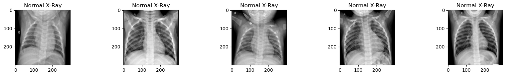
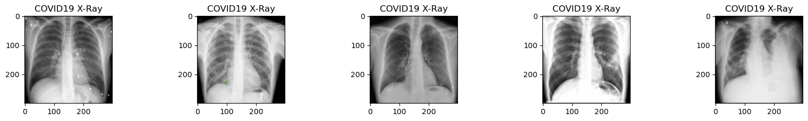
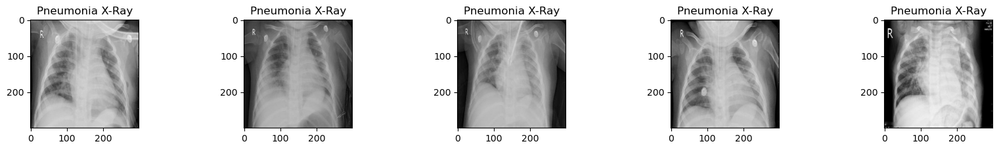
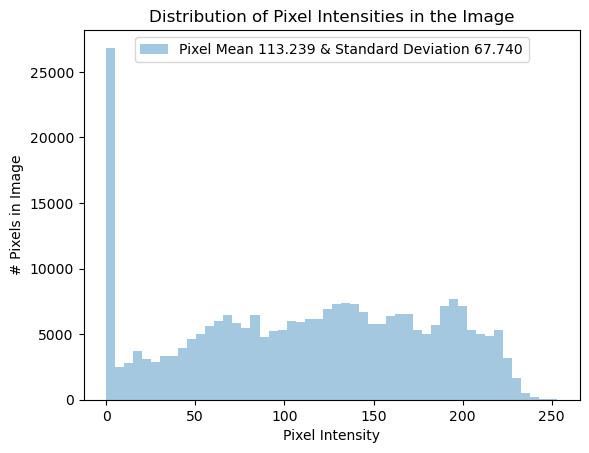
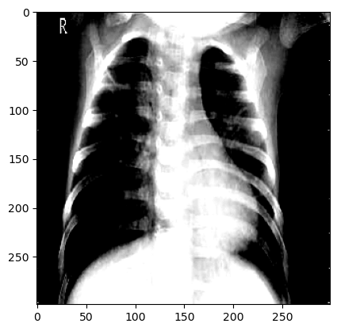
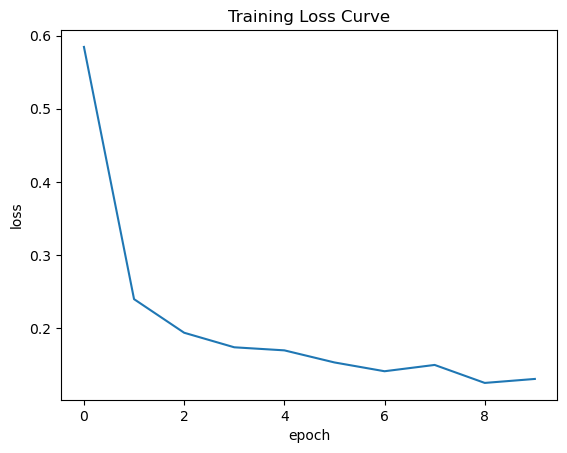
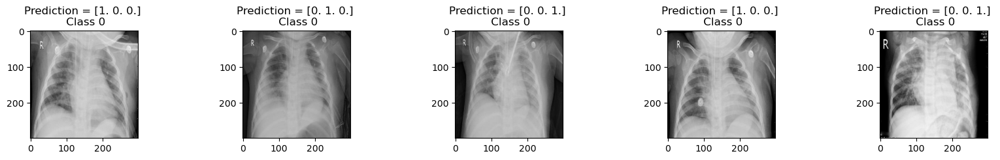
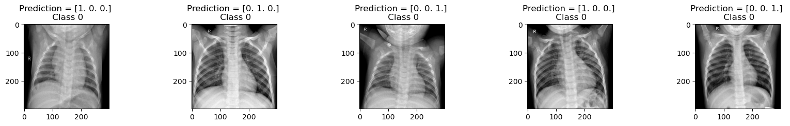
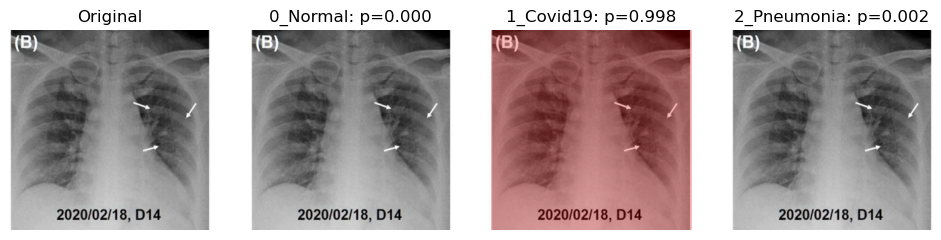

# Chest X Ray Images classification with DenseNet121 and explain with GradCam


```python
import os
import numpy as np 
import pandas as pd 
import sklearn
import matplotlib.pyplot as plt
import seaborn as sns
import matplotlib.image as mpimg
from PIL import Image
from sklearn.model_selection import train_test_split
import tensorflow as tf
from tensorflow import keras

from keras.preprocessing.image import ImageDataGenerator, load_img, img_to_array
from keras.applications.densenet import DenseNet121
from keras.layers import Dense, GlobalAveragePooling2D
from keras.models import Model, load_model

import cv2
import glob

import warnings
warnings.filterwarnings('ignore')
tf.compat.v1.logging.set_verbosity(tf.compat.v1.logging.ERROR)
```

# Data loading from path

The dataset used was downloading form kaggle, here is [the link](https://www.kaggle.com/datasets/francismon/curated-covid19-chest-xray-dataset)


```python
# for dirname, _, filenames in os.walk('/Users/lamine/tensorflow-test/dataset/'):
#     for filename in filenames:
#         print(os.path.join(dirname, filename))
```


```python
image_dir = '/Users/lamine/tensorflow-test/dataset'
dir_train = f'{image_dir}/train'
dir_valid = f'{image_dir}/validation'
```

# Functions 

Can be used as ```util.py``` file. 

The gradcam function is adated fron [here](https://gist.github.com/RaphaelMeudec/e9a805fa82880876f8d89766f0690b54)


```python
import cv2
import matplotlib.pyplot as plt
import numpy as np
from keras.models import Model
from keras.preprocessing import image
from sklearn.metrics import roc_auc_score, roc_curve
from tensorflow.compat.v1.logging import INFO, set_verbosity
from keras.utils import to_categorical   
import os

random.seed(a=None, version=2)

set_verbosity(INFO)


def get_mean_std_per_batch(image_dir, H=299, W=299):
    sample_data = []
    for img in train_generator.filepaths:
        raw_image = cv2.imread(img)
        sample_data.append(
            np.array(image.load_img(img, target_size=(H, W))))

    mean = np.mean(sample_data, axis=(0, 1, 2, 3))
    std = np.std(sample_data, axis=(0, 1, 2, 3), ddof=1)
    return mean, std


def load_image(img, image_dir, preprocess=True, H=299, W=299):
    """Load and preprocess image."""
    mean, std = get_mean_std_per_batch(image_dir, H=H, W=W)
    img_path = os.path.join(image_dir, img)
    x = image.load_img(img_path, target_size=(H, W))
    if preprocess:
        x -= mean
        x /= std
        x = np.expand_dims(x, axis=0)
    return x

def grad_cam(model, img, layer_name):
    
    grad_model = Model([model.inputs], [model.get_layer(layer_name).output, model.output])

    with tf.GradientTape() as tape:
        conv_outputs, predictions = grad_model(np.array([img]))
        pred_class = tf.argmax(predictions[0])
        loss = predictions[:, pred_class]
    
    output = conv_outputs[0]
    grads = tape.gradient(loss, conv_outputs)[0]
    
    gate_f = tf.cast(output > 0, 'float32')
    gate_r = tf.cast(grads > 0, 'float32')
    guided_grads = tf.cast(output > 0, 'float32') * tf.cast(grads > 0, 'float32') * grads
    
    weights = tf.reduce_mean(guided_grads, axis=(0, 1))
    
    cam = np.ones(output.shape[0: 2], dtype = np.float32)
    
    for i, w in enumerate(weights):
        cam += w * output[:, :, i]
    
    cam = cv2.resize(cam.numpy(), (299, 299))
    cam = np.maximum(cam, 0)
    heatmap = (cam - cam.min()) / (cam.max() - cam.min())
    
    cam = cv2.applyColorMap(np.uint8(255*heatmap), cv2.COLORMAP_JET)
    
    output_image = cv2.addWeighted(cv2.cvtColor(img.astype('uint8'), cv2.COLOR_RGB2BGR), 0.5, cam, 1, 0)
    
    return output_image


def compute_gradcam(model, img, image_dir, labels, selected_labels,
                    layer_name='bn'):
    img_path = os.path.join(image_dir, img)
    image = load_image(img, image_dir)
    predictions = model.predict(image)
    img = cv2.imread(img_path)
    print("Loading original image")
    plt.figure(figsize=(15, 10))
    plt.subplot(151)
    plt.title("Original")
    plt.axis('off')
    plt.imshow(img, cmap='gray')

    j = 1
    for i in range(len(labels)):
        if labels[i] in selected_labels:
            print(f"Generating gradcam for class {labels[i]}")
            gradcam = grad_cam(model, img, layer_name)
            plt.subplot(151 + j)
            plt.title(f"{labels[i]}: p={predictions[0][i]:.3f}")
            plt.axis('off')
            plt.imshow(img, cmap='gray')
            plt.imshow(gradcam, cmap='jet', alpha=min(0.5, predictions[0][i]))
            j += 1


def get_roc_curve(labels, predicted_vals, generator):
    auc_roc_vals = []
    for i in range(len(labels)):
        try:
            categorical_labels = to_categorical(generator.labels, num_classes=3)
            gt = categorical_labels[:, i]
            pred = predicted_vals[:, i]
            auc_roc = roc_auc_score(gt, pred)
            auc_roc_vals.append(auc_roc)
            fpr_rf, tpr_rf, _ = roc_curve(gt, pred)
            plt.figure(1, figsize=(10, 10))
            plt.plot([0, 1], [0, 1], 'k--')
            plt.plot(fpr_rf, tpr_rf,
                     label=labels[i] + " (" + str(round(auc_roc, 3)) + ")")
            plt.xlabel('False positive rate')
            plt.ylabel('True positive rate')
            plt.title('ROC curve')
            plt.legend(loc='best')
        except:
            print(
                f"Error in generating ROC curve for {labels[i]}. "
                f"Dataset lacks enough examples."
            )
    plt.show()
    return auc_roc_vals
```

# Data visualization


```python
plt.figure(figsize=(20 , 15))
for i in np.arange(1,6):
    plt.subplot(5, 5, i)
    plt.subplots_adjust(hspace = 0.5 , wspace = 0.3)
    # Normal
    dir_img = f'{dir_train}/0_Normal/Normal ({i}).jpg'
    img = cv2.imread(dir_img)
    plt.imshow(img) 
    plt.title('Normal X-Ray')
```


    

    


```python
plt.figure(figsize=(20 , 15))
for i in np.arange(1,6):
    plt.subplot(5, 5, i)
    plt.subplots_adjust(hspace = 0.5 , wspace = 0.3)
    # COVID-19
    dir_img = f'{dir_train}/1_Covid19/COVID-19 ({i}).jpg'
    img = cv2.imread(dir_img)
    plt.imshow(img) 
    plt.title('COVID19 X-Ray')
```


    

    


```python
plt.figure(figsize=(20 , 15))
for i in np.arange(1,6):
    plt.subplot(5, 5, i)
    plt.subplots_adjust(hspace = 0.5 , wspace = 0.3)
    # Pneumonia-Bacterial
    dir_img = f'{dir_train}/2_Pneumonia/Pneumonia-Bacterial ({i}).jpg'
    img = cv2.imread(dir_img)
    plt.imshow(img) 
    plt.title('Pneumonia X-Ray')
```


    

    


### Raw single image


```python
# Get the first image that was listed in the train_df dataframe
sample_img =  f'{dir_train}/0_Normal/Normal ({775}).jpg'
raw_image = plt.imread(sample_img)
plt.imshow(raw_image, cmap='gray')
plt.colorbar()
plt.title('Raw Chest X Ray Image')
print(f"The dimensions of the image are {raw_image.shape[0]} pixels width and {raw_image.shape[1]} pixels height, one single color channel")
print(f"The maximum pixel value is {raw_image.max():.3f} and the minimum is {raw_image.min():.3f}")
print(f"The mean value of the pixels is {raw_image.mean():.3f} and the standard deviation is {raw_image.std():.3f}")
```

    The dimensions of the image are 299 pixels width and 299 pixels height, one single color channel
    The maximum pixel value is 253.000 and the minimum is 0.000
    The mean value of the pixels is 113.239 and the standard deviation is 67.740


    

    


```python
# Plot a histogram of the distribution of the pixels
sns.distplot(raw_image.ravel(), 
             label=f'Pixel Mean {np.mean(raw_image):.3f} & Standard Deviation {np.std(raw_image):.3f}', kde=False)
plt.legend(loc='upper center')
plt.title('Distribution of Pixel Intensities in the Image')
plt.xlabel('Pixel Intensity')
plt.ylabel('# Pixels in Image')
```


    Text(0, 0.5, '# Pixels in Image')


    

    


```python
# Get the image shape and print it out
height, width, channels = raw_image.shape
print(f"The image object has the following dimensions: height: {height}, width: {width}, channels: {channels}")
```

    The image object has the following dimensions: height: 299, width: 299, channels: 3


# Image preprocessing and augmentation with Keras


```python
CLASSES = ['0_Normal', '1_Covid19', '2_Pneumonia']
```


```python
def get_generator(image_dir, subset=' ', classes = CLASSES, shuffle=True, batch_size=32, seed=1, target_w = 299, target_h = 299):
    """
    Return generator for training set, normalizing using batch
    statistics.

    Args:
      image_dir (str): directory where image files are held.
      batch_size (int): images per batch to be fed into model during training.
      seed (int): random seed.
      target_w (int): final width of input images.
      target_h (int): final height of input images.
      classes (str): list of labels images
    
    Returns:
        train_generator or validation_generator (DataFrameIterator): iterator over training set
    """     
    print("getting generators from path...") 
    # normalize images
    image_generator = ImageDataGenerator(
        samplewise_center=True,
        samplewise_std_normalization= True,
        validation_split=0.30)
    
    # flow from directory with specified batch size
    # and target image size
    generator = image_generator.flow_from_directory(
            directory=image_dir,
            class_mode='categorical',
            classes=CLASSES,
            batch_size=batch_size,
            shuffle=shuffle,
            seed=seed,
            subset= subset,
            target_size=(target_w,target_h))
    
    return generator
```


```python
train_generator = get_generator(dir_train, subset='training')
validation_generator = get_generator(dir_train, subset='validation')
test_generator = get_train_generator(dir_valid, subset='validation')
```

    getting generators from path...
    Found 5159 images belonging to 3 classes.
    getting generators from path...
    Found 2208 images belonging to 3 classes.
    getting train and validation generator...
    Found 551 images belonging to 3 classes.


```python
print(f"There are {train_generator.samples} images belonging to the {len(CLASSES)} classes for model training")
print(f"There are {validation_generator.samples} images belonging to the {len(CLASSES)} classes for model validation")
print(f"There are {test_generator.samples} images belonging to the {len(CLASSES)} classes for model testing")
```

    There are 5159 images belonging to the 3 classes for model training
    There are 2208 images belonging to the 3 classes for model validation
    There are 551 images belonging to the 3 classes for model testing


```python
def describeData(x, y):
    """
    x : is a generator
    y : labels generator
    """
    print('Total number of images: {}'.format(x.samples))
    print('Number of Normal images: {}'.format(np.sum(y==0)))
    print('Number of Covid images: {}'.format(np.sum(y==1)))
    print('Number of Pneumonia images: {}'.format(np.sum(y==2)))
    print('Pourcentage of positive images: {:.2f}%'.format(100*np.mean(y)))
    print('Image shape Width, height, channels: {}'.format(x.image_shape))
```


```python
describeData(train_generator, train_generator.labels)
```

    Total number of images: 5159
    Number of Normal images: 1832
    Number of Covid images: 718
    Number of Pneumonia images: 2609
    Pourcentage of positive images: 115.06%
    Image shape Width, height, channels: (299, 299, 3)


```python
x, y = train_generator.__getitem__(0)
plt.imshow(x[0]);
```

    WARNING:matplotlib.image:Clipping input data to the valid range for imshow with RGB data ([0..1] for floats or [0..255] for integers).


    

    


```python
plt.xticks(rotation=90)
plt.bar(x=CLASSES, height=np.mean(train_generator.labels, axis=0))
plt.title("Frequency of Each Class")
plt.show()
```


    

    


# Model


```python
EPOCHS = 10
NB_CLASSES = 3  
input_shape = [299, 299, 3]
```


```python
# create the base pre-trained model
base_model = DenseNet121(input_shape=input_shape,weights='imagenet',include_top=False)
for layers in base_model.layers:
    layers.trainable=False

```


```python
x = base_model.output

# add a global spatial average pooling layer
x = GlobalAveragePooling2D()(x)

prediction = Dense(NB_CLASSES, activation='softmax')(x)
model = Model(inputs=base_model.input, outputs=prediction)
```


```python
model.compile(optimizer='adam',loss='categorical_crossentropy',metrics=['accuracy'])
```

## Model train


```python
history = model.fit_generator(train_generator, 
                              validation_data=validation_generator,
                              steps_per_epoch=100, 
                              validation_steps=25, 
                              epochs = EPOCHS)

```

    Epoch 1/10


    2024-02-27 10:20:36.453024: I tensorflow/core/grappler/optimizers/custom_graph_optimizer_registry.cc:114] Plugin optimizer for device_type GPU is enabled.


    100/100 [==============================] - ETA: 0s - loss: 0.5844 - accuracy: 0.7750

    2024-02-27 10:20:50.275272: I tensorflow/core/grappler/optimizers/custom_graph_optimizer_registry.cc:114] Plugin optimizer for device_type GPU is enabled.


    100/100 [==============================] - 21s 151ms/step - loss: 0.5844 - accuracy: 0.7750 - val_loss: 0.2799 - val_accuracy: 0.9237
    Epoch 2/10
    100/100 [==============================] - 12s 119ms/step - loss: 0.2397 - accuracy: 0.9287 - val_loss: 0.2161 - val_accuracy: 0.9312
    Epoch 3/10
    100/100 [==============================] - 12s 124ms/step - loss: 0.1938 - accuracy: 0.9366 - val_loss: 0.1695 - val_accuracy: 0.9513
    Epoch 4/10
    100/100 [==============================] - 13s 125ms/step - loss: 0.1739 - accuracy: 0.9431 - val_loss: 0.1651 - val_accuracy: 0.9500
    Epoch 5/10
    100/100 [==============================] - 13s 125ms/step - loss: 0.1697 - accuracy: 0.9438 - val_loss: 0.1370 - val_accuracy: 0.9513
    Epoch 6/10
    100/100 [==============================] - 14s 138ms/step - loss: 0.1532 - accuracy: 0.9499 - val_loss: 0.1285 - val_accuracy: 0.9525
    Epoch 7/10
    100/100 [==============================] - 14s 135ms/step - loss: 0.1412 - accuracy: 0.9559 - val_loss: 0.1229 - val_accuracy: 0.9550
    Epoch 8/10
    100/100 [==============================] - 13s 134ms/step - loss: 0.1498 - accuracy: 0.9516 - val_loss: 0.1173 - val_accuracy: 0.9613
    Epoch 9/10
    100/100 [==============================] - 13s 132ms/step - loss: 0.1252 - accuracy: 0.9584 - val_loss: 0.1096 - val_accuracy: 0.9625
    Epoch 10/10
    100/100 [==============================] - 14s 138ms/step - loss: 0.1306 - accuracy: 0.9575 - val_loss: 0.1033 - val_accuracy: 0.9675


```python
pd.DataFrame(history.history).plot(figsize=(8, 5))
plt.grid(True)
plt.gca().set_ylim(0, 1)
plt.show()
```


    

    


```python
plt.plot(history.history['loss'])
plt.ylabel("loss")
plt.xlabel("epoch")
plt.title("Training Loss Curve")
plt.show()
```


    

    


## Model evaluate


```python
#evalute the model
test_loss, test_acc = model.evaluate(test_generator)
print('Test accuracy:', test_acc)
```

    18/18 [==============================] - 2s 110ms/step - loss: 0.1814 - accuracy: 0.9292
    Test accuracy: 0.9292196035385132


```python
predicted_vals = model.predict_generator(test_generator, steps = len(test_generator))
```


```python
auc_rocs = get_roc_curve(CLASSES, predicted_vals, test_generator)
```


    

    


## Label Prediction


```python
y_pred = model.predict(test_generator)
y_pred = np.around(y_pred, decimals=0)
y_test = validation_generator.classes
```

    18/18 [==============================] - 2s 109ms/step


```python
train_generator.class_indices
```


    {'0_Normal': 0, '1_Covid19': 1, '2_Pneumonia': 2}


```python
plt.figure(figsize=(20 , 15))
for i in np.arange(1,6):
    plt.subplot(5, 5, i)
    plt.subplots_adjust(hspace = 0.5 , wspace = 0.3)
    # Pneumonia-Bacterial
    dir_img = f'{dir_train}/2_Pneumonia/Pneumonia-Bacterial ({i}).jpg'
    img = cv2.imread(dir_img)
    plt.imshow(img) 
    plt.title("Prediction = {} \n Class {}".format(y_pred[i], y_test[i]))
```


    

    


```python
plt.figure(figsize=(20 , 15))
for i in np.arange(1,6):
    plt.subplot(5, 5, i)
    plt.subplots_adjust(hspace = 0.5 , wspace = 0.3)
    # Pneumonia-Bacterial
    dir_img = f'{dir_train}/0_Normal/Normal ({i}).jpg'
    img = cv2.imread(dir_img)
    plt.imshow(img) 
    plt.title("Prediction = {} \n Class {}".format(y_pred[i], y_test[i]))
```


    

    


```python
plt.figure(figsize=(20 , 15))
for i in np.arange(1,6):
    plt.subplot(5, 5, i)
    plt.subplots_adjust(hspace = 0.5 , wspace = 0.3)
    # Pneumonia-Bacterial
    dir_img = f'{dir_train}/1_Covid19/COVID-19 ({i}).jpg'
    img = cv2.imread(dir_img)
    plt.imshow(img) 
    plt.title("Prediction = {} \n Class {}".format(y_pred[i], y_test[i]))
```


    

    


# Model explain with GradCam 

## Normal Label


```python
labels_to_show = np.take(CLASSES, np.argsort(auc_rocs)[::-1])[:4]
labels_to_show
```


    array(['0_Normal', '2_Pneumonia', '1_Covid19'], dtype='<U11')


```python
dir_img = '/Users/lamine/tensorflow-test/dataset/train/0_Normal' 
compute_gradcam(model, 'Normal (775).jpg', dir_img, CLASSES, labels_to_show, layer_name='bn')
```

    2024-02-27 10:27:58.405487: I tensorflow/core/grappler/optimizers/custom_graph_optimizer_registry.cc:114] Plugin optimizer for device_type GPU is enabled.


    1/1 [==============================] - 3s 3s/step
    Loading original image
    Generating gradcam for class 0_Normal
    Generating gradcam for class 1_Covid19
    Generating gradcam for class 2_Pneumonia


    

    


```python
dir_img = '/Users/lamine/tensorflow-test/dataset/train/0_Normal' 
compute_gradcam(model, 'Normal (2551).jpg', dir_img, CLASSES, labels_to_show, layer_name='bn')
```

    1/1 [==============================] - 0s 392ms/step
    Loading original image
    Generating gradcam for class 0_Normal
    Generating gradcam for class 1_Covid19
    Generating gradcam for class 2_Pneumonia


    

    


## Covid19 label


```python
dir_covid = '/Users/lamine/tensorflow-test/dataset/train/1_Covid19'
compute_gradcam(model, 'COVID-19 (293).jpg', dir_covid, CLASSES, labels_to_show, layer_name='bn')
```

    1/1 [==============================] - 0s 297ms/step
    Loading original image
    Generating gradcam for class 0_Normal
    Generating gradcam for class 1_Covid19
    Generating gradcam for class 2_Pneumonia


    

    


```python
dir_covid = '/Users/lamine/tensorflow-test/dataset/train/1_Covid19'
compute_gradcam(model, 'COVID-19 (1020).jpg', dir_covid, CLASSES, labels_to_show, layer_name='bn')
```

    1/1 [==============================] - 0s 32ms/step
    Loading original image
    Generating gradcam for class 0_Normal
    Generating gradcam for class 1_Covid19
    Generating gradcam for class 2_Pneumonia


    

    


## Pneumonia label


```python
dir_img = '/Users/lamine/tensorflow-test/dataset/train/2_Pneumonia'
compute_gradcam(model, 'Pneumonia-Viral (291).jpg', dir_img, CLASSES, labels_to_show, layer_name='bn')
```

    1/1 [==============================] - 0s 32ms/step
    Loading original image
    Generating gradcam for class 0_Normal
    Generating gradcam for class 1_Covid19
    Generating gradcam for class 2_Pneumonia


    

    


```python
dir_img = '/Users/lamine/tensorflow-test/dataset/train/2_Pneumonia'
compute_gradcam(model, 'Pneumonia-Viral (286).jpg', dir_img, CLASSES, labels_to_show, layer_name='bn')
```

    1/1 [==============================] - 0s 32ms/step
    Loading original image
    Generating gradcam for class 0_Normal
    Generating gradcam for class 1_Covid19
    Generating gradcam for class 2_Pneumonia


    

    


```python
dir_img = '/Users/lamine/tensorflow-test/dataset/train/2_Pneumonia'
compute_gradcam(model, 'Pneumonia-Bacterial (2900).jpg', dir_img, CLASSES, labels_to_show, layer_name='bn')
```

    1/1 [==============================] - 0s 32ms/step
    Loading original image
    Generating gradcam for class 0_Normal
    Generating gradcam for class 1_Covid19
    Generating gradcam for class 2_Pneumonia


    

    


```python

```


```python

```


```python

```


```python

```
